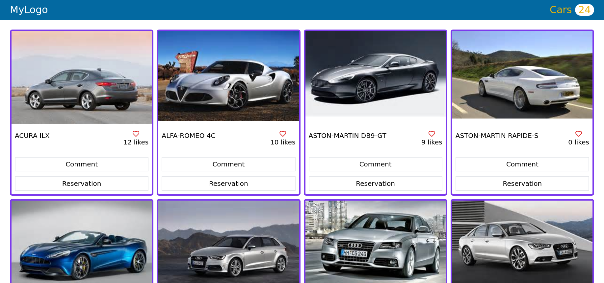

# LeaderBoard

> **CarCollectors** is website for costumers who want to rent a car. It allows the visitor to browse an extensive collection of beautiful cars using the [Cars API](https://carsapi1.docs.apiary.io/#reference/0/cars-collection). It also allows the user to like comment and make a reservation for a given car. All data are saved using the [Involvement API](https://www.notion.so/Involvement-API-869e60b5ad104603aa6db59e08150270).

## Built With

- 
- 
- 
- 
- 

## Milestones

- [x] Milestone 1: **Project Setup and topic.**
- [x] Milestone 2: **Creation the Home interface. creation the comment and the reservation pop-ups**
- [x] Milestone 3: **Creation of the communication interfaces with the APIs**
- [x] Milestone 4: **Implementation of the likes comments and the reservations functionalities**
- [x] Milestone 5: **Writing tests to ensure that the robustness of the application**

## sneak peek

## Getting Started

**Prerequisites:** A Web Browser (preferably FireFox or Chrome)

### **Option 1**

#### Use the live Website

[Leaderboard Website](https://sboursen.github.io/Leaderboard/)

### **Option 2**

#### Set up your own copy locally

- Clone [the GitHub Repository](https://github.com/Sboursen/Leaderboard)
- Go to the Project `cd Leaderboard`
- Run `npm install` to install the _dependencies_ Run `npm run start` to run the live server.

## About me

👤 **Soufiane Boursen**

- GitHub: [@Sboursen](https://github.com/Sboursen)
- Twitter: [@sboursen_dev](https://twitter.com/sboursen_dev)
- LinkedIn: [@sboursen](https://linkedin.com/in/sboursen)

## Contributors

Contributions, issues, and feature requests are welcome!

Feel free to check the [issues page](../../issues/).

## Show your support

Give a ⭐️ if you like this project!

## Acknowledgments

## 📝 License

This project is [MIT](./MIT.md) licensed.
